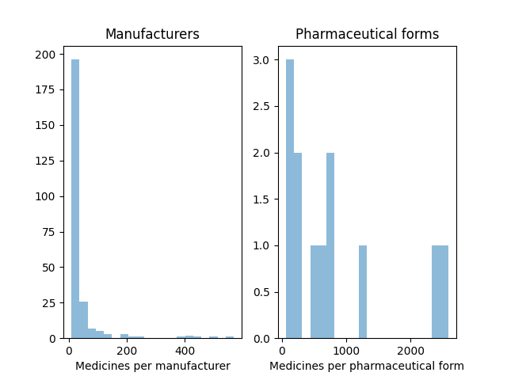
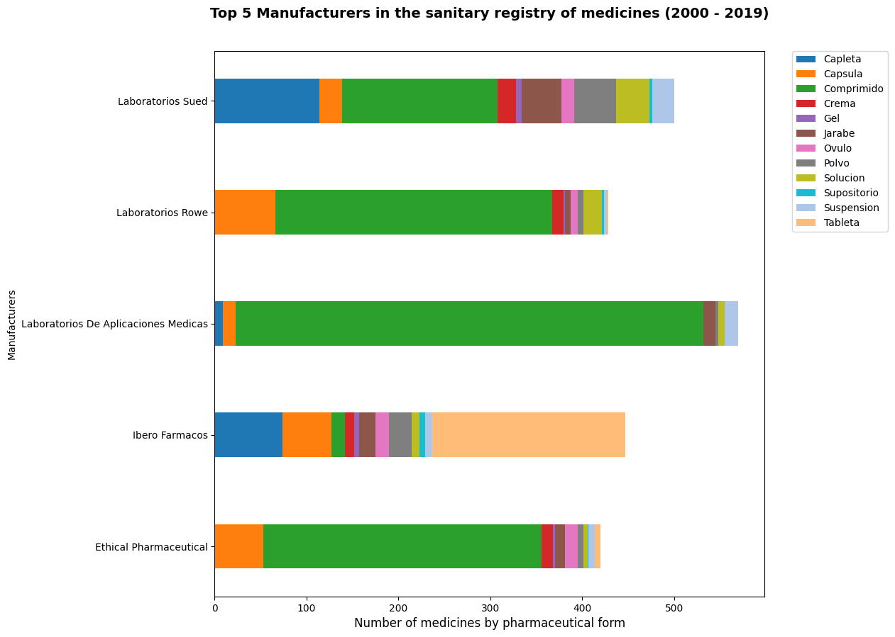
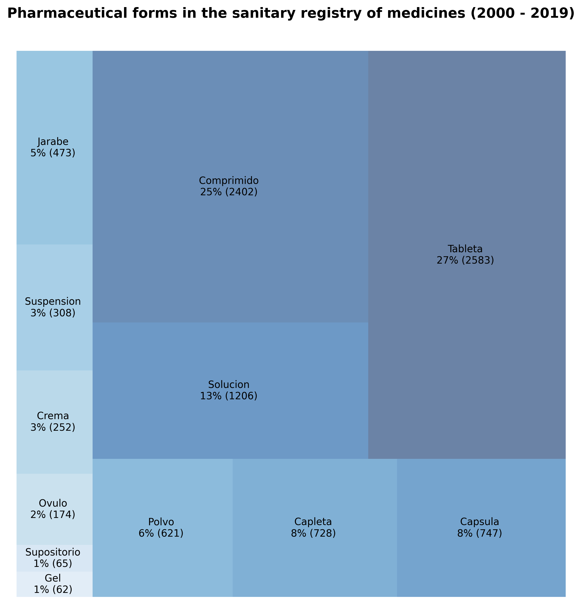
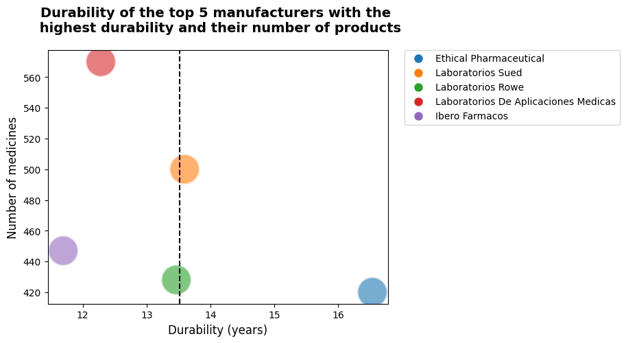

# Sanitary Registry of Medicines Analysis 

This project contains the code and data used in the analysis of the Sanitary Registry of Medicines in Dominican Republic
for analysis of the data and the generation of the report.

## Table of Contents

1. [Design goals](#design-goals)

2. [How to run the project](#how-to-run-the-project)

3. [Methodology](#methodology)

4. [Data](#data)

5. [Results](#results)

6. [Conclusions](#conclusions)

7. [Next steps](#next-steps)

## Design goals


* Determine the number of medicines by manufacturer.

* Determine the distribution of medicines by pharmaceutical form.

* Determine the historical evolution of the number of medicines requested by manufacturer.
 
* Determine which factors influence the durability of a medicine and create a model that allows to predict the expiration of a medicine based on the data of the sanitary registry.


## How to run the project

You must have installed Python 3.7 or higher and Jupyter Notebook.

To run the project, you must have the installed the
libraries in the `requirements.txt` file. To install the libraries, you must run the following command:

```bash
pip install -r requirements.txt
```

Install the recommended extensions for vscode in the `.vscode/extensions.json` file.

And then the notebooks in the following order:
process.ipynb -> analysis.ipynb -> report.ipynb.


## Data

The data used in this project is the Sanitary Registry of Medicines in Dominican Republic. This data was obtained from the
Ministry of Public Health of the Dominican Republic. The data is available in the following link: 
[Sanitary Registry of Medicines](https://datos.gob.do/dataset/registro-sanitario-de-productos-farmaceuticos).
### Raw Data


For the analysis, the following files were used:

* `data/raw/sanitary_registry_medicines.csv`: This file contains the data of the Sanitary Registry of Medicines


### Processed Data


* `data/processed/sanitary_registry_medicines.csv`: This file contains the data of the Sanitary Registry of Medicines with cleaned and formatted values.


### Final Data


* `data/final/sanitary_registry_medicines.csv`: This file contains the data of the Sanitary Registry of Medicines  without outliers.


## Methodology

The methodology used in this project is the following:

1. Data cleaning and formatting of the data. This step is done in the `notebooks/process.ipynb` notebook.

2. Data analysis. This step is done in the `notebooks/analysis.ipynb` notebook.

3. Data visualization. This step is done in the `notebooks/report.ipynb` notebook.


## Conclusions

Based on the analysis of the data, the following conclusions were obtained:

### Data Distribution
first of all, we can see that the data is not normally distributed. The distribution is right-skewed,
this means that the mean is greater than the median. This is because there are a few medicines that have a large number of pharmaceutical forms and manufacturers.



Also, we can see that there are more than 200 manufacturers with a low number of medicines requested. This is because there are a lot of small manufacturers that only request a few medicines.

### Number of medicines by manufacturer

The following table shows the number of medicines by manufacturer. We can see that the manufacturer with the most medicines is 
'Laboratorios de aplicaciones medicas' with a accumulation of more than 500 medicines requests throughout the years. This is followed by 'Laboratorios Rowe' and 'Ibero Farmacos'.





Based on the top 5 manufacturers and ther medicines pharmaceutical forms, we can see that the number of
main pharmaceutical form is 'Comprimido' followed by 'Tableta' and 'Capsula'. This is because the most common way to take a medicine is orally. and the less common is 'Supositorio', 'Ovulo' and Gel. let's see the composition of the pharmaceutical forms by medicine to see.




### Historical evolution of the number of medicines requested by manufacturer


The following graph shows the historical evolution of the number of medicines requested by manufacturer. We can see that the number of medicines requested by manufacturer has increased over the years.


We can highlight the growth of 'Laboratorios De Aplicaciones Medicas' and 'Laboratorios Rowe' in the last years. The only manufacturer that has decreased and stabilized its number of medicines requested is 'Ethical pharmaceutical'.

### Factors that influence the durability of a medicine

Based on the analysis of the data, the main factors that influence the durability of a medicine is the manufacturer 
this is because the manufacturer is the one that determines the expiration date of the medicine and the pharmaceutical form. and each pharmaceutical form has a different expiration date. let's see the distribution of the expiration date of the medicines.



The range of the durability of the medicines is between 11 and 17 years, we can highlight  'Ethical pharmaceutical' with a durability of 17
standing out from the rest of the manufacturers.


### Final

Based on the before analysis, we can conclude that the number of medicines requested by manufacturer has increased over the years. and the has a similar distribution of pharmaceutical forms. I can highlight the result of the analysis of 'Ethical pharmaceutical' that although this manufacturer is the only one that has a stable history in the requests for medicines, it has a durability of its medicines considerably higher than the mean despite not having a notable distribution of pharmaceutical forms. I consider that the durability of their medicines may have a relationship with the above and their stability over time.


## Next steps

The next steps to continue the analysis of the data can be the following:

* Analyze the distribution of the pharmaceutical forms by medicine.

* Analyze the relationship between the durability of the medicines and the pharmaceutical forms.

* Cross the data with another data set to see if there is a relationship between the durability has more factors.
